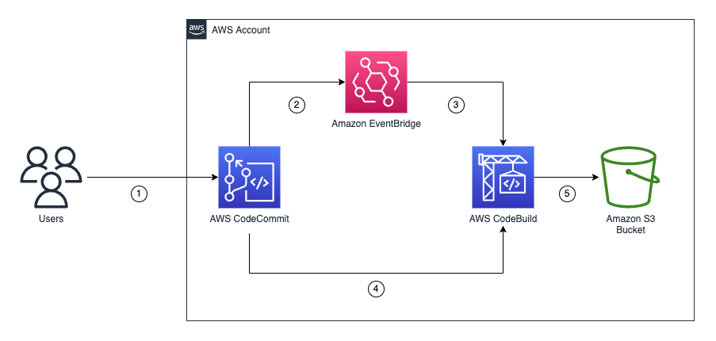

## AWS CodeCommit S3 backups with Terraform module

Take the <span style="color: red">red pill</span> and backup your AWS CodeCommit repositories to S3 with a Terraform module.  

*...or...*

Take the <span style="color: blue"> blue pill</span>  and discover that [deleting an AWS CodeCommit repository is a destructive one-way operation that cannot be undone](https://aws.amazon.com/codecommit/faqs/).

## Prerequisites

- [AWS CLI](https://docs.aws.amazon.com/cli/latest/userguide/getting-started-install.html)
- [Terraform](https://learn.hashicorp.com/tutorials/terraform/install-cli)
- At least one AWS CodeCommit repository

## Architecture


1. Users push code to a repository in CodeCommit.
2. Amazon EventBridge monitors for changes to any repository.
3. EventBridge invokes AWS CodeBuild and sends it information about the repository. 
4. CodeBuild clones the repository and packages it into a .zip file.
5. CodeBuild uploads the .zip file to an S3 bucket. 

## Module Inputs

This module is designed for a [GitHub source type](https://developer.hashicorp.com/terraform/language/modules/sources#github) but it could be cloned and deployed locally, or from a private registry.  

```
module "codecommit_s3_backup" {
  source = "github.com/aws-samples/aws-codecommit-s3-backups-with-terraform"
  name   = "codecommit-s3-backup"
}
```

The `name` will be used in the resource names, such as eventbridge rules and IAM roles. 

## Troubleshooting

| Issue | Fix |
|---|---|
| Errors containing `NO_ARTIFACTS` or `NO_SOURCE` | Run a destroy and then a fresh apply. CodeBuild projects with no artifacts and defined source may generate errors when they are being edited (rather than built fresh). |

## Related Resources

- [Automate event-driven backups from CodeCommit to Amazon S3 using CodeBuild and CloudWatch Events](https://docs.aws.amazon.com/prescriptive-guidance/latest/patterns/automate-event-driven-backups-from-codecommit-to-amazon-s3-using-codebuild-and-cloudwatch-events.html)
- [Resource: aws_codebuild_project](https://registry.terraform.io/providers/hashicorp/aws/latest/docs/resources/codebuild_project)
- [Resource: aws_cloudwatch_event_rule](https://registry.terraform.io/providers/hashicorp/aws/latest/docs/resources/cloudwatch_event_rule)

## Security

See [CONTRIBUTING](CONTRIBUTING.md#security-issue-notifications) for more information.

## License

This library is licensed under the MIT-0 License. See the LICENSE file.

